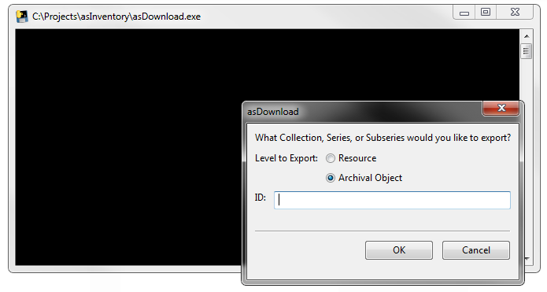
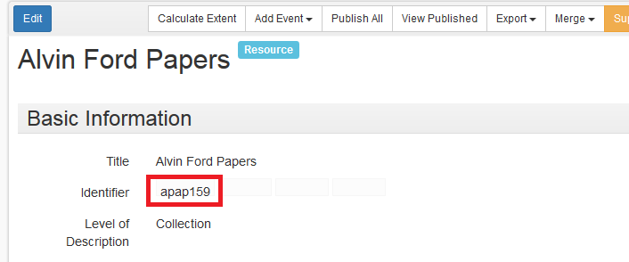
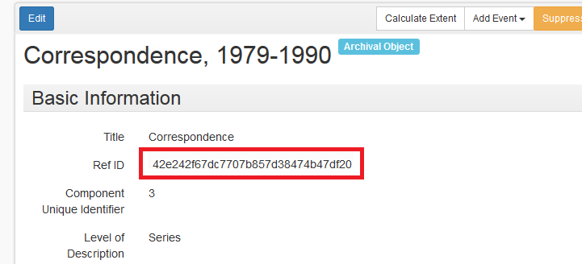
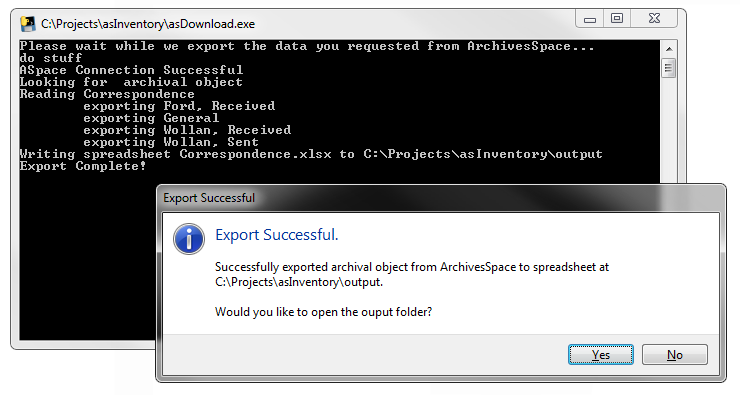
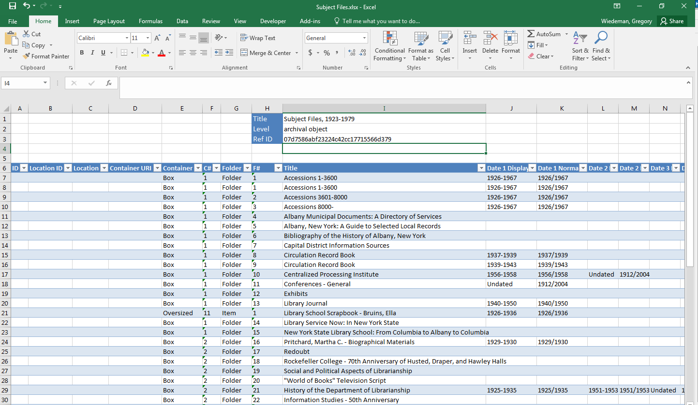

# asInventory
Manage file-level ArchivesSpace inventories with spreadsheets

### Warning note

This tool has been tested with ArchivesSpace 1.5.x on Windows at UAlbany. The Python source should also run on Mac and Linux with dependencies, but is only minimally tested on Ubuntu 14.04.

This tool makes iterative changes through the API. You should always do significant testing on a development instance of ASpace before using it on production data to make sure it acts as you expect.

## Basic Use

1. First download and extract [the zip file](https://github.com/UAlbanyArchives/archives_tools/archive/master.zip) or clone the repo with git:

	```
	git clone https://github.com/UAlbanyArchives/asInventory
	```

2. Edit the sample config file `local_settings_sample.cfg` with your ArchivesSpace credentials and rename to `local_settings.cfg` 
	* (`[asInventory]` section is only required for the optional dao upload workflow, you can add digital objects without editing these if you just enter URLs.)
3. asInventory requires three directories that will be created when you first run it:
	```
	input
	output
	complete
	dao
	```

#### To export an inventory

### (This is outdated as the GUI was removed)

1. run asDownload.exe (may take a minute to open the first time)
	
2. Select the level to export
	* Select "Resource" to export a folder list from a collection that has no series
	* Select "Archival Object" to export a folder list from a series, sub series, or other component
3. Paste in the ID for the parent of the folder list you want to export
	* For Resource, use id_0
	
	* For other components use Ref ID
	
4. Click "OK" and a list of files exported will print to the console. This may take some time for large file listings.
5. If the export is successful, you will be given the option to open the output directory to view the exported file
6. A new Spreadsheet file will be placed in the `output` directory. **WARNING: files with the same name in this directory will be overwritten.**
	

#### To import an inventory

1. Make a copy of asInventory.xlsx, you can name it anything you'd like.
2. Open the spreadsheet and add a folder listing
	* Mandatory fields:
		* Level (I2) must be "resource" for collection level with no series, or "archival object"
		* RefID (I4) must be id_0 for resource parent or ref_id for archival object parent
	* Title (I1) is not mandatory and can be anything, sheet name can also be anything
	* Many columns can be left blank
	* If an ID is entered, asInventory will find and update an existing record
	* If no ID is entered, asInventory will create a new archival object child
	* If URIs for Locations or containers are entered, asInventory will link these records to the new archival object record, if they are left place, new containers and locations will be created if a label and indicator are listed
	* Accepts up to 5 Dates and uses Normal dates (i.e. "1977/1988" or "1903-03-17/1917-01-15")
	* Display dates are optional and are entered in the ASpace Expression field
	* Can make Access Restriction (column T), General Note (column U), and Scope (column V) notes.
	* Can create and link digital objects. This can be a link entered in column W, or the filename of a file placed in the `dao` directory. If dao paths are set up correctly in `local_settings.cfg` asInventory will also rename files to their newly created ASpace IDs and move them to a webserver.
	* 
3. Save the spreadsheet to the `input` directory
4. run asUpload.exe (may take a minute to open the first time)
	* 
5. The spreadsheet file will be moved into the `complete` directory after the upload is completed. **WARNING: files with the same name in this directory will be overwritten.**

## Prerequisites

The executable files should have no dependencies on Windows other than ArchivesSpace. asInventory has been tested on 1.5.x 

Running the Python source requires Python some non-standard libraries, and the custom archives_tools library:

* [configparser](https://docs.python.org/3/library/configparser.html)
* [openpyxl](https://openpyxl.readthedocs.io/en/default/)
* [wxPython](https://wxpython.org/)
* [archives_tools](https://github.com/UAlbanyArchives/archives_tools)


#### Installing dependencies to run from Python source

These commands will install the necessary dependencies if you want to run the raw Python instead of the executable files. Python is of course required, and although all the code should be compatible with both Python 2.7 and Python 3, Python 2.7 is probably safer for wxPython.

```
pip install configparser
pip install openpyxl
git clone https://github.com/UAlbanyArchives/archives_tools
cd archives_tools
python setup.py install
```
For wxPython:
	
* For Windows use the [installer](http://www.wxpython.org/download.php), make sure to select the version compatible with your Python
* For Macs `brew install wxpython` should work, but is untested
* For Ubuntu, this should work: `sudo apt-get install python-wxgtk2.8 python-wxtools wx2.8-doc wx2.8-examples wx2.8-headers wx2.8-i18n`

## Additional features

#### Validation

`validate.exe` (and `validate.py`) will validate all dates entered in all spreadsheets in the `input` folder. This should make them compatible with ASpace to reduce errors during uploading. Hopeful more detailed validation to come.

#### Creating digital objects

`daoList.exe` will create `daoList.txt` which will list all files placed in the `dao` directory.

The envisioned use case for this is:
1. You have a lot of PDFs (or anything else really) of the folders in the file listing you want to upload.
2. You place these PDFs in the `dao` directory
3. Run `daoList.exe` to get a text listing of the files
4. Paste that listing into the upload spreadsheet in the DAO Filename column (W).
5. During upload, asInventory will create ASpace digital objects, rename these files to their ASpace UUIDs, and move them to a webserver path listed in `local_settings.cfg`

## General note on sustainability

This tool is in active use at UAlbany, and thus I'm committed to maintaining this project for at least the near future. It does rely on the custom [archives_tools](https://github.com/UAlbanyArchives/archives_tools) library with makes it relatively small and simple. (asDownload.py is under 400 lines of code, GUI and all). If a community-led ArchivesSpace library for Python is developed, I'll make a strong effort to move asInventory to that library.

## Building

The `.exe`s are built with pyinstaller

```
pyinstaller --onefile .\asUpload.py
pyinstaller --onefile .\asDownload.py
```

## Contributing

Comments and pull requests welcome.

## Authors

Greg Wiedeman

## License

This project is in the public domain