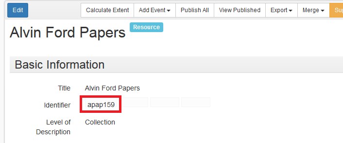
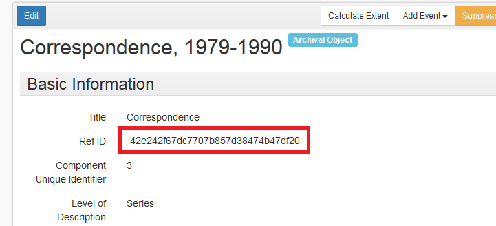
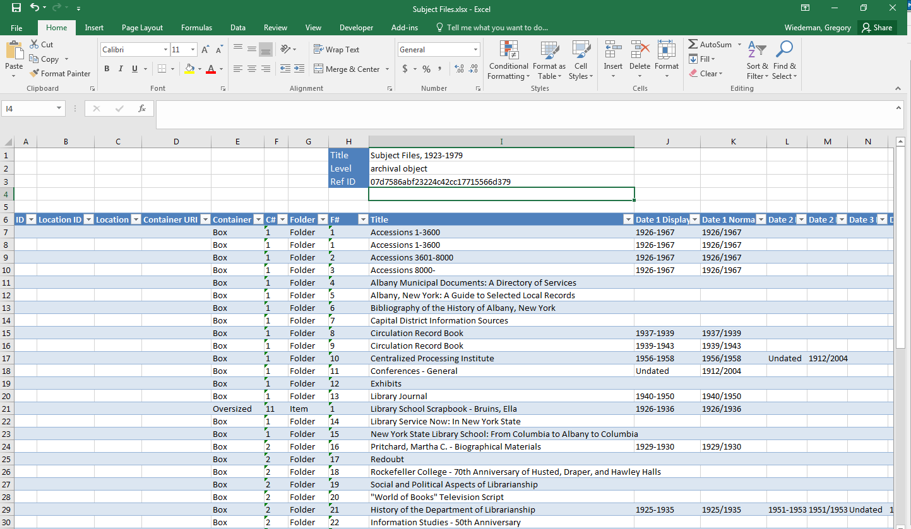

# asInventory
Manage file-level ArchivesSpace inventories with spreadsheets

Version 2.0 now uses [archivessnake](https://github.com/archivesspace-labs/ArchivesSnake)

### Warning note

This tool has been tested with ArchivesSpace 2.x-4.x. It makes iterative changes through the API. You should always do significant testing on a development instance of ASpace before using it on production data to make sure it acts as you expect.

## Installation

### Install from GitHub (Recommended)

```bash
pip install git+https://github.com/UAlbanyArchives/asInventory.git
```

### Install from local directory

```bash
git clone https://github.com/UAlbanyArchives/asInventory
cd asInventory
pip install .
```

### Development mode (for contributors)

```bash
pip install -e .
```

## Configuration

### ArchivesSnake Configuration

If you don't already have ArchivesSnake configured, create a `~/.archivessnake.yml` with your ArchivesSpace credentials:

```yaml
baseurl: https://your-aspace-instance.edu/api
username: your_username
password: your_password
```

Repository selection is currently fixed to repository `2` by default.

### Base Directory

By default, `input`, `output`, `complete`, `dao`, and `error.log` are located relative to the installed package directory (or the EXE location when frozen), which is often not where you want them when installed via pip.

Set the `ASINVENTORY_BASE_DIR` environment variable to override this default and point the tools at a working directory of your choice:

```bash
# Windows (PowerShell)
$env:ASINVENTORY_BASE_DIR = "C:\work\asinventory"

# macOS/Linux
export ASINVENTORY_BASE_DIR=/path/to/asinventory
```

The `--base-dir` CLI argument, when provided, takes precedence over `ASINVENTORY_BASE_DIR`.

### Disabling Interactive Prompts

`asdownload`, `asupload`, and `asvalidate` prompt for input (e.g. "Press Enter to continue...") by default when run directly. Set `ASINVENTORY_INTERACTIVE` to `0`, `false`, `no`, or `off` to suppress these prompts without passing `--interactive` flags:

```bash
# Windows (PowerShell)
$env:ASINVENTORY_INTERACTIVE = "0"

# macOS/Linux
export ASINVENTORY_INTERACTIVE=0
```

The `asinventory` unified CLI already runs non-interactively and is unaffected by this variable.

## Required Directories

asInventory requires these directories (will be created automatically when scripts run):
```
input
output
complete
dao
```

## Running the Scripts

After installation, you can use either the new unified CLI or the existing script entry files.

### CLI

```bash
asinventory upload
asinventory download
asinventory validate
```

Optional path overrides are available for folders that otherwise default relative to the script or EXE location:

```bash
asinventory upload --input C:\work\input --complete C:\work\complete --dao C:\work\dao
asinventory download --output C:\work\output
asinventory validate --input C:\work\input --dao C:\work\dao
```

If override arguments are omitted, the tools continue to use these default relative folders next to the script or built EXE:

```text
input
output
complete
dao
```

### Existing script and EXE workflow

The original entry files remain supported for direct execution, double-clicked EXEs, and manual PyInstaller builds.

Run scripts as console commands or directly with Python:

```bash
# Legacy console commands / optional aliases
asdownload
asupload
asvalidate

# Direct Python scripts
python asDownload.py
python asUpload.py
python asValidate.py
```

### Exporting an inventory

1. Run `asinventory download`, `asdownload`, or `python asDownload.py`
2. Select the level to export:
	* Select "Resource" (r) to export a folder list from a collection that has no series
	* Select "Archival Object" (ao) to export a folder list from a series, subseries, or other component
3. Enter the ID for the parent of the folder list you want to export:
	* For Resource, use id_0
	
	* For other components use Ref ID
	
4. Click "OK" and a list of files exported will print to the console. This may take some time for large file listings.
5. If the export is successful, you will be given the option to open the output directory to view the exported file
6. A new spreadsheet file, named after the record's ID (e.g., `<id_0>.xlsx` or `<ref_id>.xlsx`), will be placed in the `output` directory. **WARNING: files with the same name in this directory will be overwritten.**

Example with an output override:

```bash
asinventory download --output C:\work\output
```

#### To import an inventory

1. Make a copy of asInventory.xlsx and **rename the file to the record's ID**: use the `id_0` for a resource (collection with no series) or the `ref_id` for an archival object (series, subseries, or other component). The filename (minus `.xlsx`) is used as the ID — a 32-character filename is treated as an archival object `ref_id`, anything else is treated as a resource `id_0`.
2. Open the spreadsheet and add a folder listing:
	* Column headers must be on row 1, with folder listing content starting on row 2
	* Many columns can be left blank
	* If an ID (column A) is entered, asInventory will find and update an existing record
	* If no ID is entered, asInventory will create a new archival object child
	* If URIs for locations or containers are entered, asInventory will link these records; otherwise, new containers and locations will be created if a label and indicator are listed
	* Accepts up to 5 dates using ISO format (e.g., "1977/1988" or "1903-03-17/1917-01-15")
	* Display dates are optional and are entered in the ASpace Expression field
	* Can make Access Restriction (column T), General Note (column U), and Scope (column V) notes.
	* Can create and link digital objects. This can be a link entered in column W, or the filename of a file placed in the `dao` directory.
	* 
3. Save the spreadsheet to the `input` directory
4. Run `asinventory upload`, `asupload`, or `python asUpload.py` — this validates the spreadsheet first and only proceeds with the upload if no validation errors are found
5. The spreadsheet file will be moved into the `complete` directory after the upload is completed. **WARNING: files with the same name in this directory will be overwritten.**

Example with folder overrides:

```bash
asinventory upload --input C:\work\input --complete C:\work\complete --dao C:\work\dao
```

## Dependencies

Requires Python 3.7+

Dependencies are automatically installed with pip:
* [openpyxl](https://openpyxl.readthedocs.io/) (2.6.4)
* [archivessnake](https://github.com/archivesspace-labs/ArchivesSnake)
* [pyyaml](https://pyyaml.org/)

## Additional Tools

### Validation

`asinventory validate`, `asvalidate`, or `python asValidate.py` will validate all dates entered in all spreadsheets in the `input` folder. This helps ensure they're compatible with ArchivesSpace to reduce errors during upload.

Example with an input override:

```bash
asinventory validate --input C:\work\input
```

## Building Executables (Optional)

Executables can be built with PyInstaller:

```bash
pyinstaller --onefile asUpload.py
pyinstaller --onefile asDownload.py
pyinstaller --onefile asValidate.py
```

The existing `.spec` files can continue to be used as-is because the original entry scripts were preserved.

## Contributing

Comments and pull requests welcome.

## Authors

Greg Wiedeman

## License

This project is in the public domain
